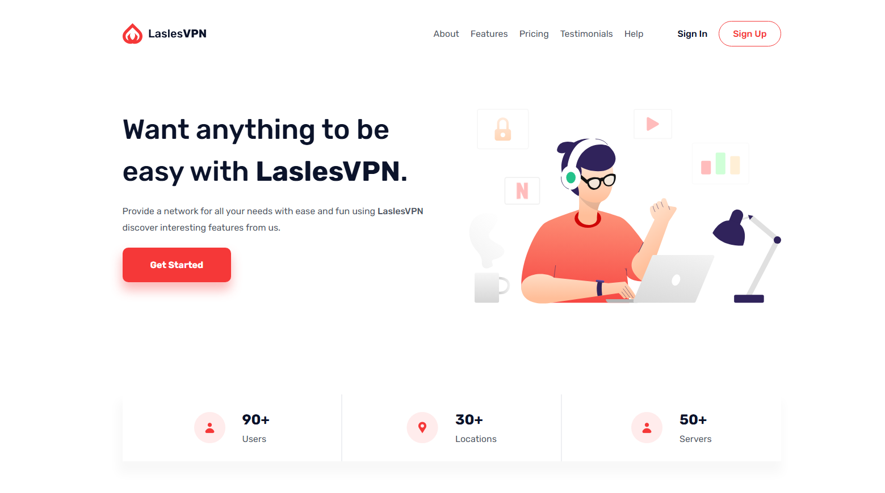

# 🌐 LaslesVPN - Landing Page

A simple **LaslesVPN landing page** built with **HTML** and **CSS** only.  
This project is a practice for frontend development focusing on clean design, responsive layout, and component-based structure.

---

## ✨ Features

- 🎨 Clean design with CSS Variables for colors and typography.
- 📱 Fully responsive (mobile, tablet, and desktop).
- 🖼️ Illustrations and icons integration.
- 🔒 Navigation bar with a responsive burger menu.
- 🎯 Well-structured code (Header, Sections, Pricing, Footer).

---

## 🛠️ Built With

- **HTML5**
- **CSS3 (Flexbox + Media Queries)**
- **Google Fonts (Rubik)**

---

## 📸 Preview

